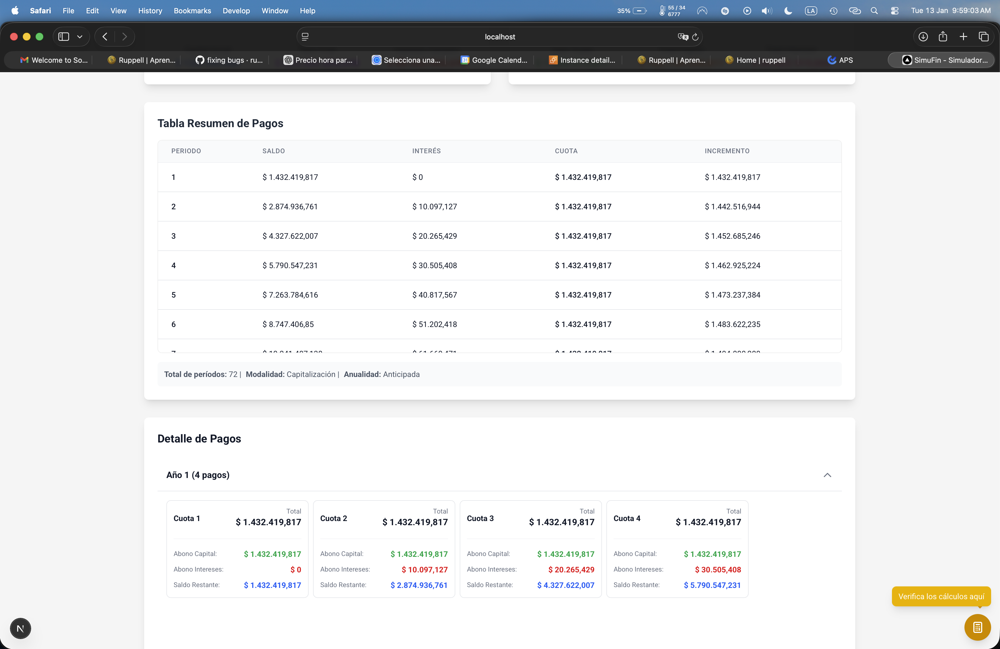

# SimuFin - Financial Simulator


<<<<<<< HEAD
An advanced financial simulator for loan and amortization calculations, developed with Next.js 16 and TypeScript. It allows for precise loan simulations with different types of rates, payment modalities, and interactive visualizations.


## Key Features

### Advanced Financial Calculations
- **Amortization and Capitalization**: Full support for both types of calculations
- **Multiple Rates**: Handling of nominal and effective rates with different frequencies
- **Payment Modalities**: Ordinary and due annuities
- **Rate Conversion**: Automatic conversion between different types and frequencies of rates

### Interactive Visualizations
- **Balance Chart**: Evolution of the loan balance over time
- **Compound Interest Chart**: Visualization of interest growth
- **Payment Chart**: Distribution between principal and interest per period
- **Informative Tooltips**: Detailed explanations with custom SVG icons


### Detailed Tables and Reports
- **Complete Payment Table**: Period 0 included with details of each payment
- **Collapsible Summary**: Condensed view with totals and statistics
- **Details Panel**: Step-by-step explanations of the calculations performed
- **Contextual Information**: Dynamic display of rate type and modality

### Modern User Interface
- **Responsive Design**: Automatic adaptation to different screen sizes
- **Reusable Components**: Consistent UI with Tailwind CSS
- **SVG Animations**: Interactive footer with visual effects
- **Smart Positioning**: Automatic adaptation based on available space




## Technologies Used

- **Frontend**: Next.js 16 with Turbopack
- **Language**: TypeScript with strict typing
- **Styles**: Tailwind CSS
- **Graphics**: Chart.js with React-Chartjs-2
- **Icons**: Lucide React
- **Linting**: ESLint with modern configuration

## Project Structure

```
simufin/
├── src/
│   ├── app/                    # Next.js App Router
│   │   ├── page.tsx           # Main page
│   │   ├── layout.tsx         # Global layout
│   │   ├── globals.css        # Global styles
│   │   └── simulation/
│   │       └── page.tsx       # Results page
│   ├── components/            # React components
│   │   ├── BalanceChart.tsx          # Balance chart
│   │   ├── CompoundInterestChart.tsx # Compound interest chart
│   │   ├── PaymentChart.tsx          # Payment chart
│   │   ├── PaymentTable.tsx          # Detailed payment table
│   │   ├── PaymentDetailView.tsx     # Payment details view
│   │   ├── LoanForm.tsx              # Main form
│   │   ├── CalculationDetailsPanel.tsx # Explanations panel
│   │   └── ui/                       # Base UI components
│   │       ├── button.tsx
│   │       ├── input.tsx
│   │       ├── select.tsx
│   │       ├── numeric-input.tsx
│   │       ├── info-tooltip.tsx
│   │       └── spiral-footer.tsx
│   ├── lib/                   # Utilities and helpers
│   │   ├── financial-utils.ts # Core financial functions
│   │   └── currency-formatter.ts # Currency formatting
│   └── types/                 # Type definitions
│       └── loan.ts           # Loan interfaces
├── public/                    # Static files
├── docker-compose.yml         # Docker configuration
├── Dockerfile                 # Docker image
└── package.json              # Project dependencies
```

## Installation and Configuration

### Prerequisites
- Node.js 18+
=======
An advanced financial simulator for loan and amortization calculations, built with Next.js 16 and TypeScript. It allows precise loan simulations with different interest rate types, payment modalities, and interactive visualizations.

## 🚀 Key Features

### 📊 Advanced Financial Calculations
- **Amortization and Capitalization**: Full support for both calculation types
- **Multiple Interest Rates**: Handling of nominal and effective rates with different frequencies
- **Payment Modalities**: Ordinary (arrears) and annuity-due (advance) payments
- **Rate Conversion**: Automatic conversion between different rate types and frequencies

### 📈 Interactive Visualizations
- **Balance Chart**: Loan balance evolution over time
- **Compound Interest Chart**: Visualization of interest growth
- **Payment Chart**: Distribution between principal and interest per period
- **Informative Tooltips**: Detailed explanations with custom SVG icons

### 📋 Detailed Tables and Reports
- **Complete Payment Table**: Includes period 0 with full payment details
- **Collapsible Summary**: Condensed view with totals and statistics
- **Detail Panel**: Step-by-step explanations of performed calculations
- **Contextual Information**: Dynamic display of rate type and payment modality

### 🎨 Modern User Interface
- **Responsive Design**: Automatic adaptation to different screen sizes
- **Reusable Components**: Consistent UI built with Tailwind CSS
- **SVG Animations**: Interactive footer with visual effects
- **Smart Positioning**: Automatic adjustment based on available space

## 🛠️ Technologies Used

- **Frontend**: Next.js 16 with Turbopack
- **Language**: TypeScript with strict typing
- **Styling**: Tailwind CSS
- **Charts**: Chart.js with React-Chartjs-2
- **Icons**: Lucide React
- **Linting**: ESLint with modern configuration

## 🔧 Installation and Setup

### Prerequisites
- Node.js 18+ 
>>>>>>> refs/remotes/origin/main
- npm or yarn
- Docker (optional)

### Local Installation

```bash
# Clone the repository
git clone https://github.com/bscantor23/simufin.git
cd simufin

# Install dependencies
npm install

# Run in development mode
npm run dev

# Open in browser
# http://localhost:3000
<<<<<<< HEAD
```

### Docker

```bash
# Build and run with Docker Compose
docker-compose up --build

# Access at http://localhost:3000
```

## Usage Guide

### 1. Loan Configuration
- **Amount**: Initial loan capital
- **Interest Rate**: Numeric value of the rate
- **Rate Type**: Nominal or Effective
- **Rate Frequency**: Annual, Semiannual, Bimonthly, Monthly
- **Modality**: Ordinary or Due
- **Number of Periods**: Loan duration
- **Calculation Type**: Amortization or Capitalization

### 2. Results Visualization
- **Interactive Charts**: Hover to see specific details
- **Detailed Table**: Expand to view all periods
- **Calculations Panel**: Step-by-step mathematical explanations

### 3. Data Interpretation
- **Amortization**: Gradual repayment of the borrowed capital
- **Capitalization**: Accumulation of interest on the capital
- **Period 0**: Initial state before the first payment
- **Totals**: Sum of all payments made

## Implemented Formulas

### Periodic Payment
- **Ordinary Amortization**: `C = [S × i × (1 + i)^n] / [(1 + i)^n - 1]`
- **Due Amortization**: `C = [S × i × (1 + i)^n] / [(1 + i)^n - 1] / (1 + i)`
- **Ordinary Capitalization**: `C = [S × i] / [(1 + i)^n - 1]`
- **Due Capitalization**: `C = [S × i] / [(1 + i)^n - 1] / (1 + i)`

### Rate Conversion
- **Nominal to Effective**: `i_effective = (1 + i_nominal/m)^m - 1`
- **Effective to Nominal**: `i_nominal = m × [(1 + i_effective)^(1/m) - 1]`
- **Frequency Change**: `i_new = (1 + i_current)^(f_new/f_current) - 1`

## Technical Features

### Smart Responsiveness
- **Desktop**: Footer fixed at the bottom of the screen
- **Mobile/Tablet**: Footer after content to avoid overlap
- **Automatic Detection**: Dynamic calculation of available space

### Performance Optimization
- **Next.js 16**: Latest version with Turbopack for fast builds
- **Memoized Components**: Avoid unnecessary re-renders
- **Lazy Loading**: Components loaded on demand

### Accessibility
- **Informative Tooltips**: Contextual explanations
- **Adequate Contrast**: Colors that meet WCAG standards
- **Keyboard Navigation**: Full accessibility support

## Available Scripts

```bash
# Development
npm run dev          # Development server

# Production
npm run build        # Production build
npm run start        # Production server

# Code Quality
npm run lint         # Run ESLint
npm run lint:fix     # Automatically fix linting errors

# Docker
docker-compose up    # Run with Docker
```

## Author

**Steban** - [bscantor23](https://github.com/bscantor23)
---
=======
>>>>>>> refs/remotes/origin/main
